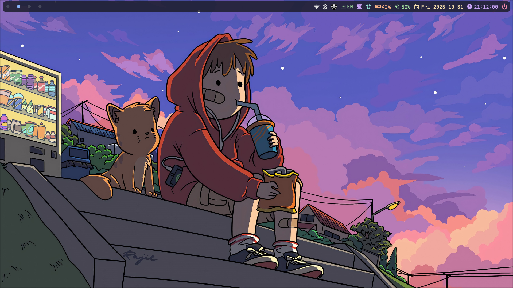

# Nix Flakes Configuration

Multi-platform Nix configuration supporting NixOS (Hyprland) and macOS (Aerospace).




## Features

- **NixOS (thinkFREE)**: Hyprland window manager with Waybar, Rofi, and Stylix theming
- **macOS (F4MWR9VVCT)**: Aerospace window manager with Sketchybar and skhd
- **Shared**: NvChad, Kitty, Tmux, Zsh, Git configuration
- **Security**: Lanzaboote secure boot on NixOS
- **Theming**: Stylix-based unified theming

## Structure

```
.
├── hosts/              # Host-specific configurations
│   ├── <hostname>/     # Your NixOS/macOS host
│   │   ├── configuration.nix  # System configuration
│   │   ├── home.nix           # Home-manager configuration
│   │   └── ...                # Additional host-specific files
├── modules/            # Reusable modules
│   ├── git.nix         # Git configuration
│   ├── hyprland.nix    # Hyprland WM (Linux)
│   ├── aerospace.nix   # Aerospace WM (macOS)
│   ├── kitty.nix       # Terminal emulator
│   ├── nvchad.nix      # Neovim configuration
│   └── ...
├── configs/            # Application configurations
│   └── nvim/           # NvChad setup
├── wallpapers/         # Wallpaper images
├── secrets.nix         # Local secrets (gitignored)
├── secrets.nix.example # Template for secrets
└── flake.nix           # Flake entry point
```

## Setup

### 1. Clone the repository

```bash
git clone https://github.com/safeith/dotnixs.git ~/.config/nix
cd ~/.config/nix
```

### 2. Configure secrets

Copy the example secrets file and fill in your values:

```bash
cp secrets.nix.example secrets.nix
```

Edit `secrets.nix` with your information:
```nix
{
  workEmail = "your.work@company.com";
  personalEmail = "your.personal@email.com";
  workUsername = "your-work-username";
  personalUsername = "your-personal-username";
}
```

### 3. Update flake.nix with your hostname

Edit `flake.nix` and replace the host configurations with your own:

```nix
nixosConfigurations = {
  yourhostname = let  # Replace with your hostname
    # ... configuration
  };
};

darwinConfigurations = {
  yourmachost = let  # Replace with your macOS hostname
    # ... configuration
  };
};
```

### 4. Build the configuration

**NixOS:**
```bash
sudo nixos-rebuild switch --flake .#yourhostname --impure
```

**macOS:**
```bash
darwin-rebuild switch --flake .#yourmachost --impure
```

> **Note:** The `--impure` flag is required because `secrets.nix` is loaded from outside the flake.

## Hosts

Replace the hostname in the build commands with your own:

### NixOS Example
- **Desktop**: Hyprland + Waybar + Rofi
- **Hardware**: Secure boot with Lanzaboote
- **Display**: Auto-scaling and multi-monitor support
- **Features**: Auto-disable laptop display when lid closes

### macOS Example
- **Desktop**: Aerospace + Sketchybar + skhd
- **Platform**: Apple Silicon (aarch64-darwin)
- **Apps**: Homebrew integration for macOS-specific apps

## Key Modules

| Module | Description |
|--------|-------------|
| `git.nix` | Git config with conditional work/personal profiles |
| `kitty.nix` | Terminal with font and theme settings |
| `nvchad.nix` | Neovim with NvChad framework |
| `hyprland.nix` | Hyprland WM with keybindings and animations |
| `waybar.nix` | Status bar for Hyprland (Linux) |
| `aerospace.nix` | Aerospace WM configuration (macOS) |
| `sketchybar.nix` | Status bar for Aerospace (macOS) |
| `stylix.nix` | System-wide theming |
| `packages.nix` | Platform-specific package lists |

## Customization

### Adding a new host

1. Create host directory: `mkdir -p hosts/newhostname`
2. Copy existing configuration: `cp -r hosts/thinkFREE/* hosts/newhostname/` (for NixOS) or `cp -r hosts/F4MWR9VVCT/* hosts/newhostname/` (for macOS)
3. Edit `hosts/newhostname/configuration.nix` and `home.nix` for your system
4. Add host to `flake.nix` under `nixosConfigurations` or `darwinConfigurations`
5. Build: `sudo nixos-rebuild switch --flake .#newhostname --impure`

### Adding packages

Edit `modules/packages.nix` and add packages to the appropriate lists:
- `commonPackages` - Available on all hosts
- `linuxPackages` - Linux-only packages
- `darwinPackages` - macOS-only packages
- `personalPackages` - Personal machine only (non-Darwin)

### Modifying themes

Edit `modules/stylix.nix` (NixOS) or `modules/stylix-home.nix` (macOS) to change:
- Base16 color scheme
- Wallpaper
- Fonts
- Cursor theme

## Maintenance

**Update flake inputs:**
```bash
nix flake update
```

**Check flake structure:**
```bash
nix flake check
```

**Format Nix files:**
```bash
nixpkgs-fmt file.nix
```

**Format Lua files:**
```bash
stylua file.lua
```

## License

This configuration is provided as-is for personal use.
